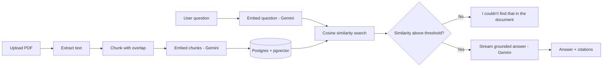

# Smart Docs — AI-Powered Document Q&A

Upload a PDF, then ask it questions in plain English. Answers are generated **only** from the document's own content using Retrieval-Augmented Generation (RAG) — with inline source citations, real-time streaming responses, and an honest "I don't know" instead of a hallucinated guess when the answer isn't actually in the document.

Built as a full-stack **PERN** application (PostgreSQL, Express, React, Node) with **Google Gemini** for embeddings and generation.


---

## ✨ Features

- **Grounded Q&A, not guesses** — every answer is generated strictly from retrieved chunks of the uploaded document. If nothing relevant is found, the app says so instead of hallucinating.
- **Inline source citations** — every answer shows which chunk(s) it pulled from, with a similarity score, so you can verify the answer yourself.
- **Real-time streaming** — answers type themselves out token-by-token over Server-Sent Events (SSE), not a single blocking response.
- **Async document processing** — uploads return instantly while text extraction, chunking, and embedding happen in the background; the UI polls status until the document is ready.
- **Full document lifecycle** — upload, chat, and delete, with deletions cascading through chat sessions, messages, and vector embeddings in Postgres automatically.
- **Auth** — JWT-based signup/login, scoped so each user only sees their own documents and conversations.

## 🧠 How it works



1. **Ingestion** — PDF text is extracted, split into overlapping ~1000-character chunks (with sentence-boundary-aware splitting so chunks don't cut mid-sentence), embedded with Gemini's embedding model, and stored in Postgres as `vector(768)` columns via **pgvector**.
2. **Retrieval** — a user's question is embedded the same way (using the appropriate asymmetric `taskType` for queries vs. documents), then compared against stored chunks using pgvector's cosine distance operator (`<=>`) to find the most relevant matches.
3. **Grounded, streamed generation** — only chunks above a similarity threshold are passed to Gemini as context, with an explicit instruction not to use outside knowledge. The response streams back token-by-token over SSE. Below the threshold, the app returns a fixed "couldn't find that" response instead of guessing.

## 🛠️ Tech stack

| Layer | Technology |
|---|---|
| Frontend | React (Vite), Tailwind CSS, lucide-react |
| Backend | Node.js, Express |
| Database | PostgreSQL + pgvector |
| AI | Google Gemini (`@google/genai`) — embeddings + chat generation |
| Auth | JWT, bcrypt |
| File handling | Multer (upload), pdf-parse (text extraction) |


## 🚀 Getting started

### Prerequisites
- Node.js 18+
- A free [Supabase](https://supabase.com) (or [Neon](https://neon.tech)) Postgres database with the **pgvector** extension
- A free [Gemini API key](https://aistudio.google.com/app/apikey)

### 1. Clone and set up the database
```bash
git clone https://github.com/Yuvrajsingh1256/smart-docs-app.git
cd smart-docs-app
```

Run the schema against your database (pgvector-enabled):
```bash
psql "your_connection_string" -f backend/src/schema.sql
```

### 2. Backend
```bash
cd backend
cp .env.example .env
# fill in DATABASE_URL, GEMINI_API_KEY, and a random JWT_SECRET
npm install
npm run dev
```
Runs on `http://localhost:5000`.

### 3. Frontend
```bash
cd frontend
npm install
npm run dev
```
Runs on `http://localhost:5173` and proxies `/api` requests to the backend.

## ⚙️ Environment variables

| Variable | Description |
|---|---|
| `DATABASE_URL` | Postgres connection string (must support pgvector) |
| `GEMINI_API_KEY` | API key from Google AI Studio |
| `JWT_SECRET` | Any long random string, used to sign auth tokens |
| `PORT` | Backend port (default `5000`) |

## 📁 Project structure

```
smart-docs-app/
├── backend/
│   └── src/
│       ├── controllers/    # auth, documents, chat route handlers
│       ├── routes/         # Express routers
│       ├── services/       # Gemini calls, PDF extraction, chunking
│       ├── middleware/      # JWT auth middleware
│       ├── db.js            # Postgres connection pool
│       ├── schema.sql        # Database schema (run once)
│       └── server.js         # App entry point
└── frontend/
    └── src/
        ├── pages/           # Login, Register, Dashboard
        └── components/      # FileUpload, DocumentList, ChatWindow
```

## 🔌 API overview

| Method | Endpoint | Description |
|---|---|---|
| `POST` | `/api/auth/register` | Create an account |
| `POST` | `/api/auth/login` | Log in, receive a JWT |
| `POST` | `/api/documents/upload` | Upload a PDF (processed asynchronously) |
| `GET` | `/api/documents` | List the current user's documents |
| `DELETE` | `/api/documents/:id` | Delete a document (cascades to chunks/chats) |
| `POST` | `/api/chat/sessions` | Start a chat session for a document |
| `GET` | `/api/chat/sessions/:id/messages` | Get message history for a session |
| `POST` | `/api/chat/sessions/:id/messages` | Send a message — **streams back an SSE response** |

## 🗺️ Possible next steps

- Support additional file types (DOCX, TXT) beyond PDF
- Multi-turn conversational memory (currently each question is answered independently)
- Rate limiting / usage quotas per user on top of the AI provider's own limits
- Adaptive or per-document similarity thresholds instead of one fixed constant

## 📄 License

MIT — feel free to use this as a starting point for your own projects.